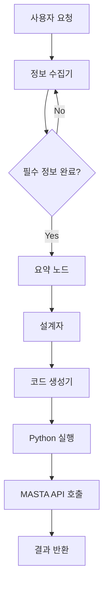

# MASTA Agent 사용 가이드

## 개요

MASTA Agent는 기어박스 설계를 위한 LangGraph 기반 AI 에이전트로, MASTA 소프트웨어와 연동하여 자동화된 기어박스 설계 워크플로우를 제공합니다.

## 아키텍처

### 시스템 구성


### 핵심 컴포넌트

#### 1. SessionData 클래스
- **목적**: 세션별 데이터 관리 및 워크플로우 상태 유지
- **주요 속성**:
  - `session_id`: 고유 세션 식별자 (UUID)
  - `workflow`: LangGraph 워크플로우 인스턴스
  - `graph`: 컴파일된 그래프 객체
  - `config`: 실행 설정 (thread_id, recursion_limit)
  - `output_dir`: 세션별 출력 디렉토리

#### 2. LangGraph 워크플로우
- **노드 구성**:
  - `chatbot`: 기어박스 정보 수집
  - `Summary`: 수집된 정보 요약
  - `Designer`: 기어박스 설계 수행
  - `CodeGen`: MASTA API 코드 생성
  - `tools`: Python 코드 실행

#### 3. Pydantic 데이터 모델
```python
class GearBoxData(BaseModel):
    life_hours: float       # 요구수명 (hr)
    input_speed: float      # 입력속도 (RPM)
    load_torque: float      # 부하토크 (N.m)
    operating_temp: float   # 작동온도 (deg)
    gear_ratio: float       # 입출력 기어비
```

## MCP 툴 함수

### 1. initialize()
```python
def initialize() -> dict:
```
**기능**: MASTA 워크플로우 초기화 및 새로운 세션 생성

**반환값**:
- `success`: 성공 여부 (bool)
- `session_id`: 생성된 세션 ID (str)
- `message`: 상태 메시지 (str)
- `output_directory`: 세션 출력 디렉토리 (str)

**예제**:
```json
{
  "success": true,
  "message": "새 세션(a1b2c3d4)이 생성되고 초기화되었습니다",
  "session_id": "a1b2c3d4-e5f6-7890-abcd-ef1234567890",
  "output_directory": "D:/SW/Streamlit/MCP servers/outputs/a1b2c3d4-e5f6-7890-abcd-ef1234567890",
  "status": "initialized"
}
```

### 2. process_gearbox_request()
```python
def process_gearbox_request(user_message: str, session_id: str) -> dict:
```
**기능**: 사용자의 기어박스 설계 요청 처리

**매개변수**:
- `user_message`: 기어박스 설계 관련 사용자 메시지
- `session_id`: 초기화된 세션 ID

**반환값**:
- `success`: 성공 여부 (bool)
- `message`: 처리 상태 메시지 (str)
- `events`: 워크플로우 실행 이벤트 목록 (list)
- `session_id`: 세션 ID (str)

### 3. get_session_messages()
```python
def get_session_messages(session_id: str) -> dict:
```
**기능**: 세션의 대화 메시지 히스토리 조회

**반환값**:
- `success`: 성공 여부 (bool)
- `messages`: 메시지 리스트 (list)
- `message_count`: 메시지 개수 (int)
- `session_id`: 세션 ID (str)

### 4. get_active_sessions()
```python
def get_active_sessions() -> dict:
```
**기능**: 현재 활성 세션들의 정보 반환

**반환값**:
- `active_sessions`: 활성 세션 수 (int)
- `sessions`: 세션 상세 정보 리스트 (list)

### 5. get_session_files()
```python
def get_session_files(session_id: str) -> dict:
```
**기능**: 세션에서 생성된 파일 목록 반환

**반환값**:
- `success`: 성공 여부 (bool)
- `files`: 파일 목록 (list)
- `file_count`: 파일 개수 (int)
- `session_id`: 세션 ID (str)

## 워크플로우 단계

### 1단계: 정보 수집 (Chatbot Node)
- **역할**: 기어박스 설계에 필요한 5가지 필수 정보 수집
- **필수 정보**:
  1. 요구수명 (단위: hr)
  2. 입력속도 (단위: RPM)
  3. 부하토크 (단위: N.m)
  4. 작동온도 (단위: deg)
  5. 입출력 기어비

- **동작 방식**:
  - 누락된 정보가 있으면 추가 질문 생성
  - 모든 정보가 수집되면 다음 단계로 진행

### 2단계: 정보 요약 (Summary Node)
- **역할**: 수집된 정보를 구조화된 형태로 요약
- **출력**: 기어박스 설계 정보 요약 메시지

### 3단계: 설계 수행 (Designer Node)
- **역할**: 기어박스 설계 로직 실행
- **설계 프로세스**:
  1. 기어비 분석 및 기어 쌍 개수 결정
  2. 평기어 쌍 설계 (모듈, 잇수, 치폭 등)
  3. 축 개수 및 제원 결정
  4. 축 위치 및 기어 장착 위치 결정
  5. 베어링 개수 및 장착 위치 결정

### 4단계: 코드 생성 (CodeGen Node)
- **역할**: MASTA API를 사용한 Python 코드 생성
- **생성 순서**:
  1. MASTA 초기화
  2. 기어 생성 및 제원 수정
  3. 축 생성 및 배치
  4. 기어 배치
  5. 베어링 생성, 배치 및 designation 설정
  6. 모델 이미지 생성

### 5단계: 코드 실행 (Tools Node)
- **역할**: 생성된 Python 코드 실행
- **실행 환경**: PythonREPL을 통한 MASTA API 호출
- **결과**: 기어박스 3D 모델 및 시각화

## 사용 예제

### 기본 사용 순서

1. **초기화**
```python
# MCP 클라이언트를 통한 호출
result = mcp_client.call_tool("initialize")
session_id = result["session_id"]
```

2. **기어박스 설계 요청**
```python
user_request = """
요구수명은 1000시간이고, 입력속도는 1500 RPM입니다.
부하토크는 150 N.m이고, 작동온도는 80도입니다.
기어비는 4입니다.
"""

result = mcp_client.call_tool("process_gearbox_request", {
    "user_message": user_request,
    "session_id": session_id
})
```

3. **결과 확인**
```python
# 메시지 히스토리 조회
messages = mcp_client.call_tool("get_session_messages", {
    "session_id": session_id
})

# 생성된 파일 조회
files = mcp_client.call_tool("get_session_files", {
    "session_id": session_id
})
```

### 대화형 사용 예제
```
User: "기어박스를 설계하고 싶어요"

Agent: "안녕하세요! 기어박스 설계를 도와드리겠습니다. 아래의 정보를 입력해주세요!
1) 요구수명 (단위: hr)
2) 입력속도 (단위: RPM)
3) 부하토크 (단위: N.m)
4) 작동온도 (단위: deg)
5) 입출력 기어비"

User: "요구수명은 500시간, 입력속도는 1200 RPM, 부하토크는 100 N.m, 작동온도는 60도, 기어비는 3입니다."

Agent: "기어박스 설계를 위한 정보수집이 완료되었습니다.
==================================
요구수명 : 500.0 [hr]
입력속도 : 1200.0 [rpm]
부하토크 : 100.0 [N.m]
작동온도 : 60.0 [deg]
요구기어비 : 3.0"

[설계 과정 진행...]
[MASTA 코드 생성 및 실행]
[3D 모델 생성 완료]
```

## 세션 관리

### 세션 생명 주기
1. **생성**: `initialize()` 호출 시 UUID 기반 세션 생성
2. **활성**: 1시간 동안 자동 유지
3. **정리**: 타임아웃 시 자동 삭제 (파일 포함)

### 세션 타임아웃
- **기본값**: 3600초 (1시간)
- **정리 주기**: 300초 (5분)마다 만료된 세션 확인
- **백그라운드 스레드**: 자동 정리 수행

### 출력 파일 관리
- **구조**:
```
MCP servers/outputs/
└── {session_id}/
    ├── images/          # 기어박스 이미지 파일
    └── reports/         # 설계 보고서 파일
```

## MASTA API 통합

### 초기화 코드 템플릿
```python
# mastapy 초기화
import math
import Utility
import mastapy
from mastapy import init

init(r'C:\Program Files\SMT\MASTA 13.0.3')

# 새로운 Design 작성
from mastapy.system_model import Design

my_design = Design()
assembly = my_design.root_assembly

# 단위 환산 준비
MM = 1e-3
RAD = math.pi/180
RPM = 2*math.pi/60
```

### 기어박스 모델링 순서
1. **기어 생성**: `assembly.add_cylindrical_gear_pair()`
2. **기어 제원 수정**: 모듈, 헬리컬각, 압력각, 잇수, 치폭 설정
3. **축 생성**: `assembly.add_shaft()`
4. **축 배치**: 3D 위치 설정
5. **기어 배치**: 축에 기어 장착
6. **베어링 생성**: `assembly.add_bearing()`
7. **베어링 배치**: 축에 베어링 장착
8. **베어링 designation 설정**: 카탈로그에서 적절한 베어링 선택
9. **시각화**: `Utility.plot_images(assembly=assembly)`

## 에러 처리

### 일반적인 오류 상황
1. **세션 없음**: `initialize()` 호출 없이 다른 함수 호출
2. **MASTA 설치 없음**: MASTA 소프트웨어 미설치
3. **API 키 없음**: OpenAI API 키 미설정
4. **메모리 부족**: 대용량 모델 처리 시 메모리 초과

### 오류 메시지 예제
```json
{
  "error": "세션 'invalid-id'를 찾을 수 없습니다. initialize()을 먼저 호출하세요.",
  "session_id": "invalid-id"
}
```

## 의존성 및 설치

### 필수 패키지
```bash
# 기본 패키지 설치
uv add langchain-openai
uv add langchain-core
uv add langchain-experimental
uv add langgraph
uv add pydantic
uv add python-dotenv
uv add mcp
```

### 환경 설정
1. **MASTA 설치**: SMT MASTA 13.0.3 이상
2. **환경 변수**: `.env` 파일에 OpenAI API 키 설정
```bash
OPENAI_API_KEY="your_openai_api_key_here"
```

## 성능 최적화

### 메모리 관리
- 세션당 독립적인 메모리 공간
- 자동 세션 정리로 메모리 누수 방지
- LangGraph 체크포인터를 통한 상태 관리

### 실행 시간 최적화
- GPT-4o-mini 사용으로 빠른 정보 수집
- GPT-4o 사용으로 정확한 설계 및 코드 생성
- Python REPL 재사용으로 초기화 시간 단축

## 트러블슈팅

### 자주 발생하는 문제

1. **인코딩 오류**
   - 해결: 파일 상단에 `# -*- coding: utf-8 -*-` 추가

2. **모듈 임포트 오류**
   - 해결: `uv add langchain-experimental` 실행

3. **MCP 서버 시작 오류**
   - 해결: `mcp.run()` 직접 호출 (asyncio.run() 사용 금지)

4. **MASTA API 오류**
   - 해결: MASTA 소프트웨어 설치 경로 확인
   - 경로: `C:\Program Files\SMT\MASTA 13.0.3`

### 로그 확인
```python
# 디버깅을 위한 로그 출력
print("Starting MASTA MCP server...")
print(f"세션 타임아웃: {SESSION_TIMEOUT}초")
print("백그라운드 세션 정리 스레드 시작됨")
```

## 향후 개발 계획

### 기능 확장
- [ ] 다양한 기어 타입 지원 (헬리컬, 베벨 등)
- [ ] 재료 선택 자동화
- [ ] 안전계수 최적화
- [ ] 비용 분석 기능

### 성능 개선
- [ ] 병렬 처리 지원
- [ ] 캐싱 시스템 도입
- [ ] 실시간 진행 상황 표시

### 사용성 향상
- [ ] 웹 인터페이스 개발
- [ ] 설계 템플릿 제공
- [ ] 결과 비교 기능